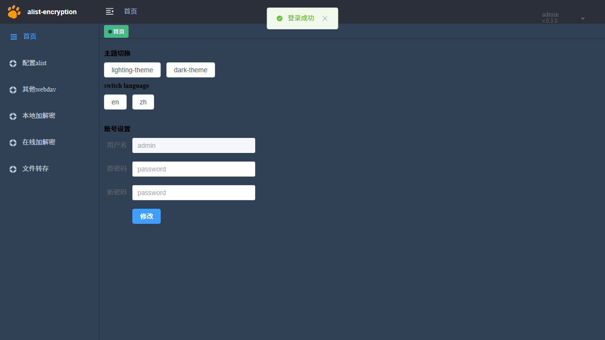

# alist-encrypt-txiki

[](LICENSE)
[](https://github.com/ayueyang/alist-encrypt-txiki/releases)
[](#支持平台)
[](https://github.com/saghul/txiki.js)

**用 [txiki.js](https://github.com/saghul/txiki.js) 运行时替代 Node.js 跑 [alist-encrypt](https://github.com/traceless/alist-encrypt)，让它能在路由器上运行。**

An adaptation of [alist-encrypt](https://github.com/traceless/alist-encrypt) that runs on the
[txiki.js](https://github.com/saghul/txiki.js) runtime instead of Node.js — same application code,
same business logic, now deployable on OpenWrt routers and on desktop Linux / Windows.

---

**目录**　[为什么有这个项目](#为什么有这个项目) · [特性](#特性) · [支持平台](#支持平台) ·
[快速开始](#快速开始) · [命令行工具](#命令行工具) · [与上游的关系](#与上游的关系) ·
[已知限制](#已知限制) · [文档](#文档) · [开发与测试](#开发与测试) · [贡献](#贡献) ·
[许可与致谢](#许可与致谢)

---

## 为什么有这个项目

上游 alist-encrypt 是 Node.js 应用。路由器上装 Node.js 代价很高：Node 的运行时与 `node_modules`
在 OpenWrt 这类嵌入式系统上占用可观的空间和内存，而 OpenWrt 本身的包管理也不覆盖 npm 生态。

[txiki.js](https://github.com/saghul/txiki.js) 是一个小巧的 JavaScript 运行时，基于 QuickJS + libuv，
在 OpenWrt 上有可用的构建方式。本项目把 alist-encrypt 的 Node 依赖收敛到 txiki.js 的能力面，
使同一个 AList 加解密代理可以跑在低功耗设备上。

**这不是重写。** 加密算法、文件命名协议、AList 路由与 WebDAV 规则全部沿用上游实现，适配只发生在
运行时边界——模块加载、文件 I/O、HTTP、流、加密与数据访问层。详见[与上游的关系](#与上游的关系)。

> 以上是能写进 README 的理由。
> **真正的原因**：~~原作者请喝奶茶，迫不及待给 AI 充值，顺便帮忙移植。~~

## 特性

- **透明代理**：AList 网页上的操作照常透传，加密目录的上传/下载自动加解密。
- **在线播放**：流式加密，加密视频可直接在网页播放、图片可在线查看，无需先下载解密。
- **WebDAV 透明**：WebDAV 客户端上的操作不受影响，自动加解密。
- **多算法**：AES-CTR（默认，性能与安全性最好）、RC4（适合不支持 AES 指令的设备）、MIX（早期混淆方案，不推荐）。
- **多平台**：OpenWrt（aarch64 / x86_64）与桌面 Linux / Windows 共用同一套应用代码。
- **可独立更新上游**：上游业务源码留在原位置，可直接与上游 diff 复核。

## 支持平台

| 平台 | 运行时 | 状态 |
|---|---|---|
| OpenWrt（`aarch64_generic` / `x86_64`） | 本项目构建的 txiki.js 软件包 | 支持 |
| Linux（x86_64 / aarch64） | 自行编译 txiki.js（官方无 Linux 二进制） | 支持 |
| Windows（x86_64） | txiki.js 官方 release | 基本支持，WebDAV 方法不可用（官方二进制未打包该能力） |

固定基线：上游 `main@3d5f19f`、txiki.js `v26.6.0`。验证矩阵与逐项测试记录见 [tests/](tests/)。

## 快速开始

### 方式一：OpenWrt 安装预编译包

应用包本身与架构无关（`PKGARCH:=all`），但**依赖运行时 `txiki-js`**（Makefile 中 `DEPENDS:=+txiki-js`）。
官方源的 `txiki-js` 发行包缺少 WebDAV 方法支持，本项目使用自行重建的版本，随 Release 一并提供：

| 设备架构 | 运行时（先装） | 应用包（后装） |
|---|---|---|
| `aarch64_generic` | `txiki-js-26.6.0-r3-aarch64.apk` | `alist-encrypt-tjs-0.3.0-r9.apk` |
| `x86_64` | `txiki-js-26.6.0-r4-x86_64.apk` | `alist-encrypt-tjs-0.3.0-r9.apk`（同一文件） |

从 [Releases](https://github.com/ayueyang/alist-encrypt-txiki/releases) 下载对应文件并上传到设备：

```sh
# 文件名以最新 Release 为准，下例为 aarch64 + 0.3.0-r9
apk add --allow-untrusted /tmp/txiki-js-26.6.0-r3-aarch64.apk
apk add --allow-untrusted /tmp/alist-encrypt-tjs-0.3.0-r9.apk
```

> 安装前请核对 sha256/md5 与 Release 说明一致（Release 附 `SHA256SUMS` / `MD5SUMS`）。
> 若设备上已有官方源的 `txiki-js`，请先替换为本处提供的重建版本，否则 WebDAV 客户端方法
> （`PROPFIND` 等）不可用——官方 prebuilt 的 libwebsockets 未编译该能力。

服务由 procd 托管，配置文件在 `/etc/config/alist-encrypt`：

```sh
uci set alist-encrypt.main.alist_host='192.168.1.10:5244'   # AList 地址
uci set alist-encrypt.main.home='/etc/alist-encrypt'        # 数据与配置目录
uci commit alist-encrypt

/etc/init.d/alist-encrypt enable
/etc/init.d/alist-encrypt start
```

可配置项：`enabled`（是否随系统启动）、`home`（数据目录，默认 `/etc/alist-encrypt`）、
`alist_host`（AList 地址）、`run_mode`（默认 `PROD`）。日志用 `logread -e alist-encrypt` 查看。

### 方式二：桌面运行

先准备该平台的 `tjs` 可执行文件（Linux 需自行编译 txiki.js），再构建并启动：

```sh
cd openwrt-tjs
npm ci
node build.mjs
tjs run dist/server.mjs
```

### 方式三：从源码构建 OpenWrt 软件包

需要 OpenWrt SDK，以及两份不属于本仓库的构建输入：

```sh
git clone --branch v26.6.0 https://github.com/saghul/txiki.js
git clone https://github.com/simd-everywhere/simde

export TXIKI_SOURCE_DIR=$PWD/txiki.js
export TJS_SIMDE_SOURCE=$PWD/simde

sh openwrt-tjs/scripts/build-openwrt-package.sh /path/to/openwrt-sdk
```

产物落在 `openwrt-tjs/output/`。

### 首次配置

启动后打开配置页：

```
http://<设备地址>:5344/public/index.html
```

默认账号 `admin` / `123456`，**首次登录后请立即修改**。在配置页填入 AList 地址与需要加密的目录规则，
之后访问 `http://<设备地址>:5344` 即可经代理使用 AList。



**路径规则**支持正则表达式，例如 `movie_encrypt/.*` 表示该目录下所有文件都加密传输。

> 规则建议写成相对父目录的形式（如 `movie_encrypt/.*`），不要锚定到具体文件名——否则
> `orig_` 前缀的明文回退文件会因为路径不匹配而无法打开。

## 命令行工具

OpenWrt 包内含一个转换命令，用于在分享文件时本地加密/解密：

```sh
alist-encrypt-convert <参数>
```

对应桌面环境执行 `tjs run openwrt-tjs/dist/convert.mjs <参数>`。

## 与上游的关系

本仓库包含上游应用源码**加上**一层运行时适配，两者边界清晰：

| 目录 | 内容 | 与上游的关系 |
|---|---|---|
| `node-proxy/` | 后端（29 个业务源文件） | **22 个与上游逐字节相同**（忽略行尾，见下），其余 7 个的差异全部在运行时边界 |
| `enc-webui/` | 前端源码（300 文件） | 全部与上游逐字节相同 |
| `openwrt-tjs/` | **本项目新增**：平台垫片、构建脚本、OpenWrt 打包、测试 | 上游没有 |
| `dockerfile` | 上游 Node 版本的容器构建，未修改 | 不适用于 txiki 适配版，本项目不提供镜像 |

保留上游目录结构是刻意为之：你可以直接对着上游复核。

```sh
git clone https://github.com/traceless/alist-encrypt /tmp/upstream

diff -rq --strip-trailing-cr /tmp/upstream/node-proxy/src node-proxy/src   # 应只列出 7 个文件
diff -rq /tmp/upstream/enc-webui enc-webui                                # 应无输出
```

> **为什么加 `--strip-trailing-cr`**：上游仓库自身混用 LF 与 CRLF，本项目在编辑过程中把部分文件
> 统一成了 LF。严格 `diff -r` 会因此多报 `node-proxy/src/dao/fileDao.js`——该文件与上游**只差行尾**。
> 换行差异容易掩盖真实差异，也容易把行尾差异误当代码差异，所以这里只比内容。

改动清单与逐项理由见 [docs/porting-code-review.md](docs/porting-code-review.md)；
上游自身的业务逻辑问题只登记不修改，记录在 [docs/upstream-issues.md](docs/upstream-issues.md)。

## 已知限制

- **`Expect: 100-continue`**：未按 HTTP 语义完整实现，部分客户端的上传前协商会被跳过。
- **下游取消信号**：客户端中断时的取消传播语义与 Node 版存在差异。
- **Windows 官方二进制缺少 WebDAV 方法**：需使用自行编译的 txiki.js 才能启用 WebDAV。
- **纯内网环境下 AList 页面加载外部 CDN 图片会失败**：属上游页面行为，非代理问题。

以上限制均未被伪装成已支持。逐项原因与替代方案见
[docs/openwrt-tjs-unsupported-and-replacements.md](docs/openwrt-tjs-unsupported-and-replacements.md)。

## 文档

| 文档 | 内容 |
|---|---|
| [docs/background.md](docs/background.md) | 项目背景、加密算法选择与性能数据 |
| [docs/openwrt-tjs-compatibility.md](docs/openwrt-tjs-compatibility.md) | 兼容性总表：Node API 对照与替换关系 |
| [docs/openwrt-tjs-unsupported-and-replacements.md](docs/openwrt-tjs-unsupported-and-replacements.md) | 不支持的能力与替代方案 |
| [docs/porting-code-review.md](docs/porting-code-review.md) | 代码审查报告：逐文件差异与判定 |
| [docs/upstream-issues.md](docs/upstream-issues.md) | 上游业务逻辑问题登记（未修改） |
| [docs/api-test-guide.md](docs/api-test-guide.md) | 测试方法说明 |

## 开发与测试

```sh
cd openwrt-tjs
npm ci
node build.mjs          # 产出 dist/server.mjs
```

测试代码在 `openwrt-tjs/tests/`，运行记录在 [`tests/`](tests/)（按日期归档）。

**验证原则**：平台结论必须由该平台自身的 txiki 运行时执行产出——OpenWrt 侧为设备内 `/usr/bin/tjs`，
桌面侧为对应平台的 `tjs`。加密改动必须同时通过 Node 固定向量与 txiki 固定向量对照。
构建产物应与上游 Node 版本密文逐字节一致，这是回归的主要判据。

## 贡献

欢迎提交 Issue 与 Pull Request。请注意：

1. **不要在适配层重写上游业务语义**——如需改动上游行为，请先在上游仓库讨论。
2. 新增平台适配请集中在 `openwrt-tjs/src/platform/`，不要散落到业务文件里。
3. 提交前跑一遍 `node build.mjs` 并确认无解析错误。
4. 凭据、内网地址、个人路径不要写进仓库。

## 许可与致谢

以 **ISC** 发布，见 [LICENSE](LICENSE)。

- 上游应用 [traceless/alist-encrypt](https://github.com/traceless/alist-encrypt) —— ISC。
  本项目的算法实现、命名协议与业务逻辑均来自该项目。
- 运行时 [saghul/txiki.js](https://github.com/saghul/txiki.js) —— MIT。
- [simd-everywhere/simde](https://github.com/simd-everywhere/simde) —— MIT（txiki.js 的构建依赖）。

完整归属说明见 [NOTICE](NOTICE)。
